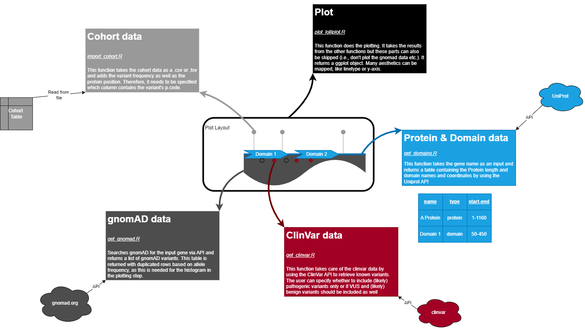
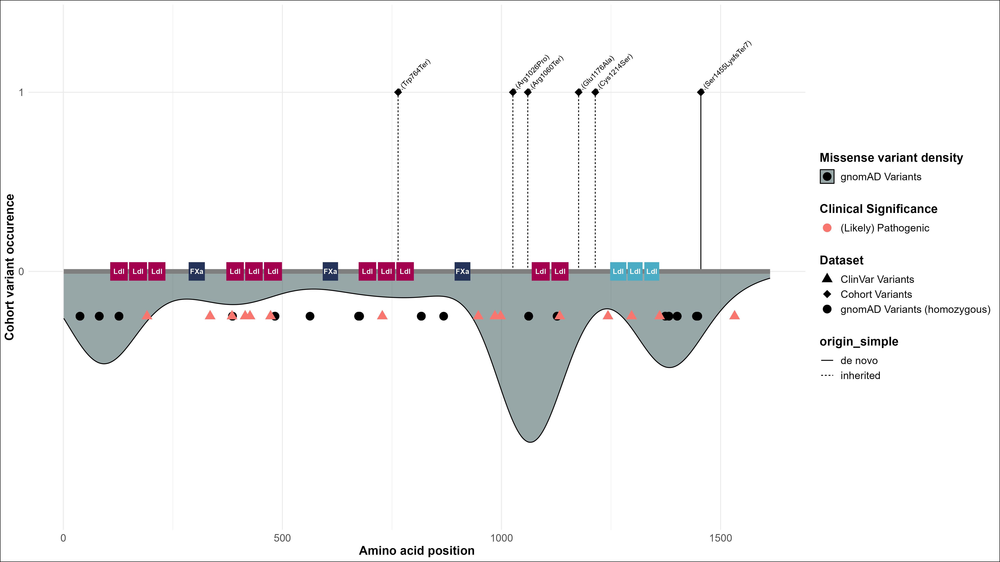
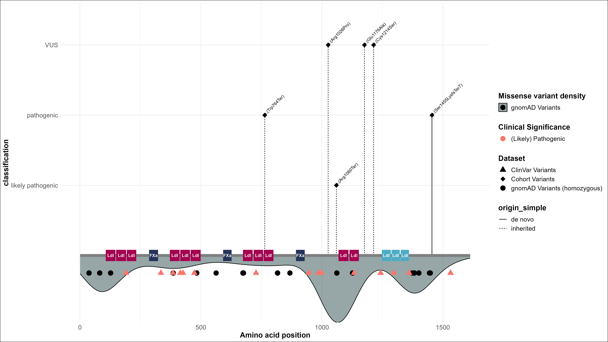
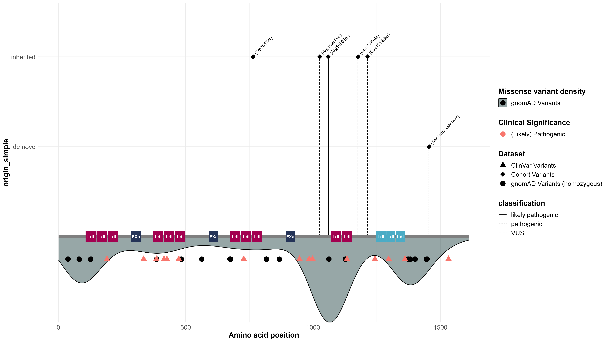
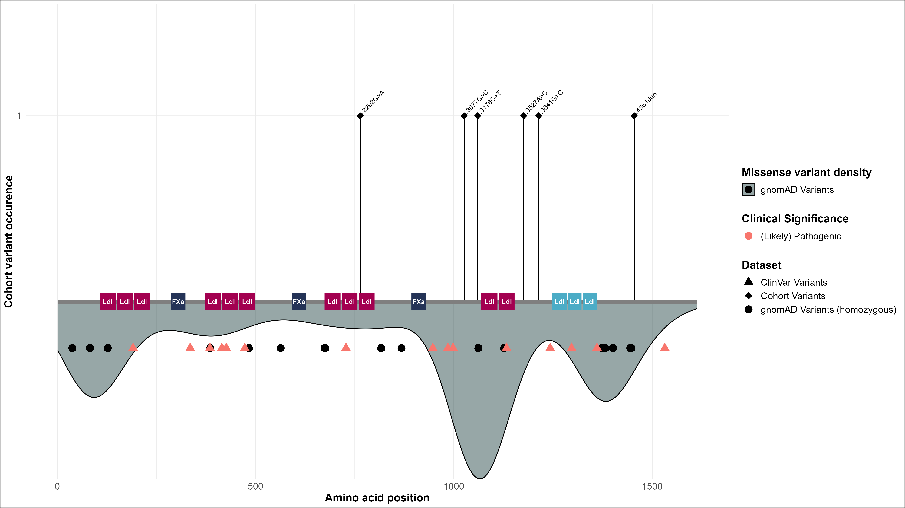

# LolliplotR
R Package for generating publication ready lolliplots based on genetic variants

## Introduction

### Functions overview

To generate a lolliplot, we use 4 different functions outlined here: 



### `import_cohort`

This function imports your cohort from a .tsv or .csv file. Include as much information as possible, but the only mandatory value is the **p. code** of your variants you want to plot. 

An example of how the cohort data could look like is: 

| Person ID | variant_c | **variant_p**  | origin    | zygosity     |
|-----------|-----------|------------|-----------|--------------|
| P1        | c.123A>T  | **p.Arg41Thr** | de novo   | heterozygous |
| P2        | c.456G>T  | **p.Cys152Ter**  | inherited | homozygous   |

The more details you provide, the more aesthetics you can use for the plotting, which will be discussed later.

### `get_clinvar`

This function gets the ClinVar variants for your gene of interest. Simply provide the gene name and the minimum clinical significance at which the variants should be retained.

### `get_gnomad`

This function uses the gnomAD API to get the gnomad Variants for your gene of interest. It returns a dataframe suitable for the density-plotting in ggplot.

### `get_domains`

This function uses the Uniprot API to retrieve the Pfam domains for your gene of interest.

### `plot_lolliplot`

This function then does the plotting. It takes the data generated by the functions above and also takes aesthetics arguments for the plotting. 

## Usage and examples

First import the cohort. You can also use the example dataset provided in the package:

```r
examplepath = system.file("extdata", "LRP6_patient_variants.csv", package="LolliplotR")
LRP6_cohort = import_cohort(path_to_cohort = examplepath, p_code_column = "variant_p"
```

Then get the ClinVar variants, gnomAD data and domains for *LRP6*

```r
LRP6_clinvar = get_clinvar("LRP6")
LRP6_gnomad = get_gnomad(gene = "LRP6", outlier_shrinkfactor = 100)
LRP6_domains = get_domains("LRP6")
```

Now we do the plotting. 

```r
LRP6_lolliplot = plot_lolliplot(cohort = LRP6_cohort, domains = LRP6_domains, 
clinvar = LRP6_clinvar, gnomad = LRP6_gnomad, .label = "variant_p", .linetype = "origin_simple")
```

And have a look at the results:



### Aesthetics mapping

The `plot_lolliplot` function understands several aesthetics which can be mapped to the plot, basically you only need to provide the column name. Currently, following aesthetics can be provided: 

- `.y`: The values to be used as y-axis breaks
- `.linetype`: aesthetics to be used as linetype 
- `.label`: the label for the cohort data

> More aesthetics will follow soon!

As you will see, the aesthetics basically depend on the column names of your cohort data. The more info you have in your cohort, the more aesthetics you can use. To change the aesthetic labels, simply change the column name in your cohort data (for example from `origin_simple` to `Origin`)

Here are some examples how to specify the aesthetics and how they influence the plot:

#### `.y`: y-axis aesthetics

```r
LRP6_lolliplot = plot_lolliplot(cohort = LRP6_cohort, domains = LRP6_domains, 
clinvar = LRP6_clinvar, gnomad = LRP6_gnomad, .label = "variant_p", .linetype = "origin_simple", .y = "classification")
```



#### `.linetype`: linetype aesthetics

```r
LRP6_lolliplot = plot_lolliplot(cohort = LRP6_cohort, domains = LRP6_domains, 
clinvar = LRP6_clinvar, gnomad = LRP6_gnomad, .label = "variant_p", .linetype = "classification", .y = "origin_simple")
```



#### `.label`: label aesthetics

```r
LRP6_lolliplot = plot_lolliplot(cohort = LRP6_cohort, domains = LRP6_domains, 
clinvar = LRP6_clinvar, gnomad = LRP6_gnomad, .label = "variant_c")
```

 